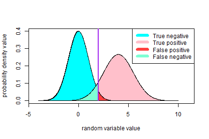

## What is it about

Course Project description had no specific topic or theme, instead it was
suggested to 'make a pith' (whatever that means ...). So I've decided to give
some more details on my shiny-app that was the first part of the Course Project.

The topic of the project was rejection/acceptance of the null-hypothesis. It's
a core-concept beyond practically each statistical method.

--- .class #id

## Motivation

Rejection of null-hypothesis addresses one the most important questions of
statistic as a science - what practical result can we get from knowing
probabilistic properties of the subject of interest?

Many perfectly good explanations of this subject can be found in numerous sources.
The goal of this work was to implement 'by-hand' necessary calculations to get a
deeper grasp into the subject.

To run the application one can follow this link:
https://pglushkov.shinyapps.io/course_project/
Short manual is presented on the page.

--- .class #id

## Demonstration of results

Example of output, generated by implemented shiny-app:


```r
# you really don't want to see the mess behind it, trust me! :)
# see the repository for actual code if you so like...
source('plot_the_plot.R')
plot_ze_plot();
```



--- &radio

## Final quiz

What to you think about this brilliant presentation ?

1. Presentation is truly magnificent and authors should be presented with a freaking medal!
2. _Presentation is mediocre and barely hides author's inability to come up with a decent pack of slides_
3. This presentation is disastrous and represents everything that is wrong with this world. Author should be sent to Mars in a barrel.

*** .hint
This is le hint

*** .explanation
Obviously author did have any bright idea about how to 'make ze pitch' and just
implemented a couple of slides in order to show that he managed to catch the
bare basics of Slidify package.
